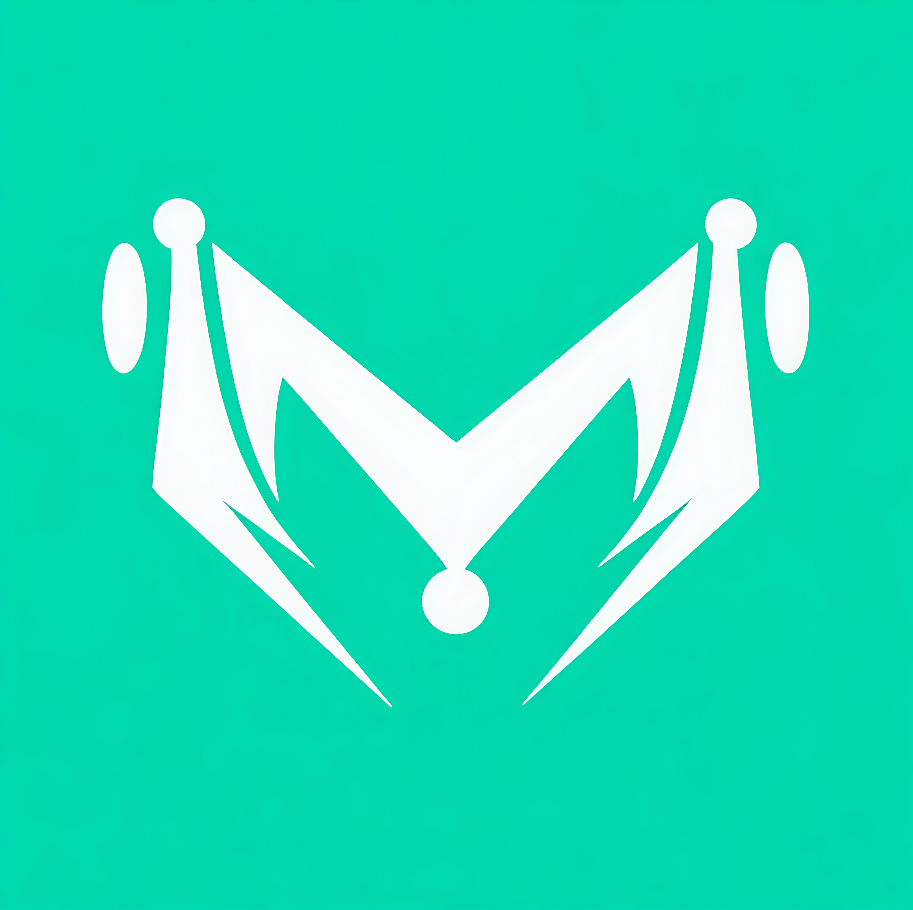

<p align="center">
  
</p>

<h1 align="center">MANTX</h1>

<p align="center">
  <strong>The Autonomous AI Model Training, Comparison & Agentic Intelligence Engine for the Terra Ecosystem</strong><br>
  <em>Zero Cost • 6h GitHub Actions Compute • HuggingFace ZeroGPU • Synthetic Data Forge • Closed-Loop MLOps</em>
</p>

<p align="center">
  
  
  
  
  
</p>

---

## 🌟 ¿Qué es MANTX?

**MANTX** es el motor autónomo de ingeniería de modelos de IA, fine-tuning y ejecución agéntica de **Terra**. Permite sintetizar datasets con **Constitutional AI**, entrenar modelos personalizados (**Nimphys**) con **LoRA/QLoRA/RAFT** aprovechando las 6 horas de cómputo gratuito de GitHub Actions, comparar modelos en tiempo real (**Deimatic Battles**) y desplegar un agente de código autónomo (**Mantx Code**) con deliberación en mesa redonda, todo a **coste $0**.

---

## 🏰 Arquitectura del Ecosistema

```
                                  🏰 MANTX ENGINE
                                (Control Plane & CLI)
                                          │
    ┌───────────────────┬─────────────────┼─────────────────┬───────────────────┐
    ▼                   ▼                 ▼                 ▼                   ▼
🗂️ MODEL MARKETPLACE  🔑 AKG GATEWAY  🧠 ECDYSIS MEMORY  ⚔️ DEIMATIC BATTLES  🧬 NMPHY FORGE
(GGUF/Ollama Catalog) (Key Pool & 429) (Vector & Graphs)  (Multi-Model Arena)  (LoRA/RAFT/Evol)
    │                   │                 │                 │                   │
    └───────────────────┴─────────────────┼─────────────────┴───────────────────┘
                                          ▼
                                🤖 MANTX CODE AGENT
                      (Round Table: Architect, Coder, Reviewer)
                                          │
                                          ▼
                                🔄 CLOSED-LOOP MLOPS
                      (Drift Detection ➔ Auto-Retrain ➔ Release)
```

---

## 📦 Instalación y Arranque Rápido

```powershell
# Instalación global vía npm
npm install -g terra-mantx

# Inicializar entorno y storage vault (.mantx-storage)
mantx init

# Abrir Consola Web SPA interactiva
mantx console --port 7430
```

---

## 🗂️ 1. Model Marketplace & Runtime Router

Catálogo curado de modelos sub-4B optimizados para ejecución veloz en CPU en runners de GitHub Actions:

- **Llama 3.2 1B & 3B Instruct** (1.1B - 3.2B | GGUF Q4 | Razonamiento general)
- **Qwen 2.5 Coder 1.5B & 3B Instruct** (1.5B - 3.0B | GGUF Q4 | Especialista en código, 32k tokens)
- **DeepSeek Coder 1.3B Instruct** (1.3B | GGUF Q4 | Generación y autocompletado)
- **Phi 3.5 Mini Instruct 3.8B** (3.8B | GGUF Q4 | Razonamiento lógico y matemático, 128k tokens)
- **Google Gemma 2 2B IT** (2.6B | GGUF Q4 | Chat conversacional y filtrado de seguridad)
- **Google Gemini 3.7 Flash & DeepSeek V3** (vía TERMES Symbiont Bridge | Inferencia Web $0)

```powershell
# Listar modelos con filtros por especialización
mantx models list --specialization code

# Planificar ejecución y recursos en Actions CPU
mantx runtime plan --model qwen-2.5-coder-3b --env action_cpu

# Generar workflow YAML listo para GitHub Actions
mantx runtime workflow --model qwen-2.5-coder-3b --name "Qwen Code Runner"
```

---

## 🔑 2. Mantx AKG (API Key Gateway)

Elimina los bloqueos por límites de cuota (HTTP 429) y centraliza tus claves BYOK (Groq, Gemini, DeepSeek, OpenAI, Anthropic, Termes):

```powershell
# Crear un pool de claves con estrategia de rotación
mantx akg pool create --name "Production VIP Pool" --strategy round_robin

# Añadir claves al pool (auto-detección de proveedor)
mantx akg key add --pool <poolId> --key "AIzaSy..." --alias "Gemini Primary"
mantx akg key add --pool <poolId> --key "gsk_..." --alias "Groq Llama-70B"

# Probar inferencia con balanceo y failover automático
mantx akg test --pool <poolId> --prompt "¿Qué es el Teorema de CAP?"
```

---

## 🧠 3. Memoria Semántica Ecdysis & Graph RAG

Capa de memoria persistente entre sesiones con búsqueda vectorial en CPU (<1ms) y grafo de relaciones de conceptos (Arzor Graph RAG):

```powershell
# Añadir recuerdos al grafo de conocimiento
mantx memory add --project my-app --text "El backend usa TypeScript con arquitectura hexagonal" --category user_preference
mantx memory add --project my-app --text "La base de datos es PostgreSQL con Prisma ORM" --category domain_knowledge

# Recuperar contexto semántico relevante
mantx memory query --project my-app --prompt "¿Qué stack y arquitectura usamos?"
```

---

## ⚔️ 4. Deimatic Battles & Wars Arena

Enfrenta múltiples modelos en paralelo y obtén métricas detalladas (latencia, tok/s, calidad semántica y arbitraje por IA):

```powershell
# Batalla de una ronda con RAG de grafos
mantx battle run --candidates termes-gemini-3.7,termes-deepseek-v3 --prompt "¿Por qué Rust es seguro en concurrencia?" --rag graph

# Deimatic War (Guerra multirronda con estado continuo)
mantx war start --candidates termes-gemini-3.7,termes-deepseek-v3 --rounds "Define idempotencia;¿Cómo se implementa en HTTP?;Escribe un ejemplo en TypeScript"
```

---

## 🧬 5. Nimphys & Synthetic Data Forge

Sintetiza datasets con **Evol-Instruct** y **Constitutional AI**, y entrena modelos personalizados con versionado automático (`v1`, `v2`, `v3`):

```powershell
# Generar dataset sintético (Alpaca / ChatML / RAFT)
mantx forge create --name "PostgreSQL QA" --objective "Optimización de consultas complejas y EXPLAIN ANALYZE" --samples 100 --format alpaca

# Generar workflow de Fine-Tuning LoRA/QLoRA para GitHub Actions (6h compute)
mantx train qlora --base-model qwen-2.5-coder-3b --dataset <forgeId> --name "Qwen-SQL-Optimizer"

# Desplegar servidor REST OpenAI-Compatible para el Nimphy entrenado ($0 compute)
mantx nimphys serve --id <nimphyId> --port 7430 --timeout 15
```

---

## 🤖 6. Mantx Code & Round Tables

Agente autónomo de desarrollo en terminal con deliberación multi-agente:

```powershell
# Ejecución autónoma de tareas de programación
mantx code run --prompt "Crear una función TypeScript para validar JWTs sin dependencias externas"

# Deliberación en Mesa Redonda (Architect, Coder, Reviewer, Tester)
mantx code roundtable --topic "Diseñar arquitectura de streaming WebSocket con reconexión exponencial"
```

---

## 📈 7. Production Intelligence (Closed-Loop)

Auditoría continua de salud en producción y disparo automático de reentrenamiento cuando se detecta degradación de calidad:

```powershell
# Establecer baseline de calidad mínima esperada
mantx intelligence baseline --nimphy <id> --prompts "Explica el borrow checker;Crea una función genérica" --expected "Ownership;Generics"

# Auditar drift y auto-reentrenar si el score cae >15%
mantx intelligence check --nimphy <id> --auto-retrain
```

---

## 🔌 Consumo de APIs (OpenAI Compatible)

### 🐍 Python (OpenAI SDK Standard):
```python
from openai import OpenAI

client = OpenAI(
    base_url="http://127.0.0.1:7430/v1",
    api_key="sk-mantx-dev"
)

response = client.chat.completions.create(
    model="Qwen-Rust-Expert",
    messages=[{"role": "user", "content": "Explica lifetimes en structs de Rust"}]
)

print(response.choices[0].message.content)
```

### 🔵 cURL / PowerShell:
```powershell
$body = '{"model":"Qwen-Rust-Expert","messages":[{"role":"user","content":"Hola"}]}'
Invoke-RestMethod -Uri "http://127.0.0.1:7430/v1/chat/completions" -Method POST -ContentType "application/json" -Body $body
```

---

## 📄 Licencia

Desarrollado bajo licencia **MIT** como parte del **Ecosistema Terra** por **AMG Logicalis**.
