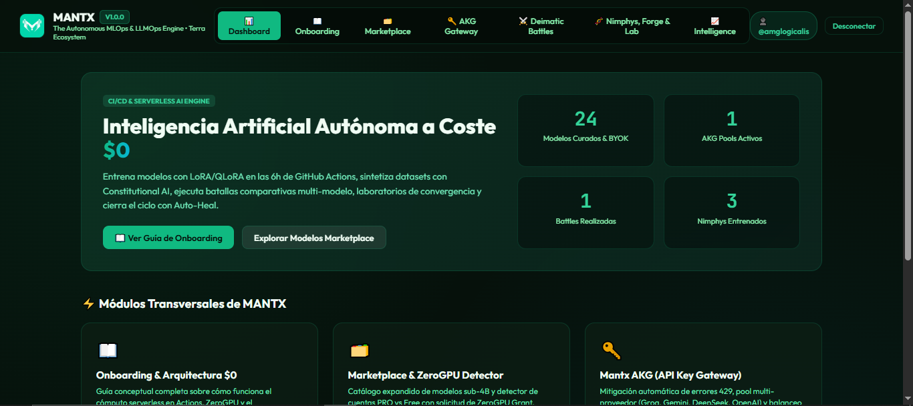

<p align="center">
  
</p>

<h1 align="center">MANTX</h1>

<p align="center">
  <strong>The Autonomous AI Model Training, Comparison & Agentic Intelligence Engine for the Terra Ecosystem</strong><br>
  <em>Zero Cost • 6h GitHub Actions Compute • HuggingFace ZeroGPU • Synthetic Data Forge • Closed-Loop MLOps</em>
</p>

<p align="center">
  <a href="https://amglogicalis.github.io/mantx-repo-public/" target="_blank">
    
  </a>
</p>

<p align="center">
  
  
  
  
  
  
</p>

---

## 🖥️ Vista Previa de la Consola Web (MANTX SPA)

<p align="center">
  <a href="https://amglogicalis.github.io/mantx-repo-public/" target="_blank">
    
  </a>
</p>
<p align="center">
  👉 <strong><a href="https://amglogicalis.github.io/mantx-repo-public/">Haz clic aquí para abrir la Consola Web Online en GitHub Pages</a></strong> o ejecútala en local con <code>mantx console</code>.
</p>

---

## 📑 Tabla de Contenidos

1. [🌟 Filosofía de Arquitectura ($0 Cost MLOps & LLMOps)](#-filosofía-de-arquitectura-0-cost-mlops--llmops)
2. [📦 Instalación y Arranque Rápido](#-instalación-y-arranque-rápido)
3. [🗂️ 1. Model Marketplace & Runtime Router](#️-1-model-marketplace--runtime-router)
4. [🔑 2. Mantx AKG (API Key Gateway & Mitigación 429)](#-2-mantx-akg-api-key-gateway--mitigación-429)
5. [🧠 3. Ecdysis Semantic Memory & Graph RAG](#-3-ecdysis-semantic-memory--graph-rag)
6. [🧬 4. Synthetic Data Forge (Evol-Instruct & Crítico Constitucional)](#-4-synthetic-data-forge-evol-instruct--crítico-constitucional)
7. [🏋️ 5. Nimphys & Motor de Entrenamiento CI/CD](#️-5-nimphys--motor-de-entrenamiento-cicd)
8. [🧪 6. Nimphys Laboratory Matrix Studio](#-6-nimphys-laboratory-matrix-studio)
9. [⚔️ 7. Deimatic Battles & Wars Arena](#️-7-deimatic-battles--wars-arena)
10. [🛡️ 8. Production Intelligence & Auto-Heal (Bucle Cerrado)](#-8-production-intelligence--auto-heal-bucle-cerrado)
11. [🔬 9. AFT Studio (Adaptive Fractal Tuning)](#-9-aft-studio-adaptive-fractal-tuning)
12. [📦 10. Storage Vault & GitHub Releases ($0 Storage)](#-10-storage-vault--github-releases-0-storage)
13. [💻 11. Referencia Completa del CLI & SDK](#-11-referencia-completa-del-cli--sdk)
14. [💡 12. Buenas y Malas Prácticas](#-12-buenas-y-malas-prácticas)
15. [❓ 13. FAQ & Solución de Errores Comunes](#-13-faq--solución-de-errores-comunes)

---

## 🌟 Filosofía de Arquitectura ($0 Cost MLOps & LLMOps)

MANTX rompe con el paradigma de las plataformas de IA costosas. Su arquitectura descentralizada opera enteramente sobre recursos en la nube gratuitos:

- **6 Horas de Cómputo por Runner**: Ejecución de backpropagation, fine-tuning y benchmarks en runners de GitHub Actions sin coste.
- **Almacenamiento Binario $0**: Versionado de adaptadores y archivos `.gguf` de hasta 2GB en GitHub Releases de tu repositorio privado `.mantx-storage`.
- **Inferencia Gratuita ZeroGPU**: Integración con HuggingFace Spaces y soporte para BYOK con mitigación automática de límites de tasa (HTTP 429).
- **Auto-Heal en Bucle Cerrado**: Detección de degradación de calidad y auto-reentrenamiento con garantía de no-regresión.

```
                                  🏰 MANTX ENGINE
                                (Control Plane & CLI)
                                          │
    ┌───────────────────┬─────────────────┼─────────────────┬───────────────────┐
    ▼                   ▼                 ▼                 ▼                   ▼
🗂️ MODEL MARKETPLACE  🔑 AKG GATEWAY  🧠 ECDYSIS MEMORY  ⚔️ DEIMATIC BATTLES  🧬 SYNTHETIC FORGE
(GGUF/Ollama Catalog) (Key Pool & 429) (Vector & Graphs)  (Multi-Model Arena)  (Evol-Instruct/AFT)
    │                   │                 │                 │                   │
    └───────────────────┴─────────────────┼─────────────────┴───────────────────┘
                                          ▼
                                🏋️ NIMPHYS & LAB MATRIX
                          (LoRA, QLoRA, RAFT, Actions CI/CD)
                                          │
                                          ▼
                                🛡️ CLOSED-LOOP AUTO-HEAL
                      (Drift Audit ➔ Forge Refinement ➔ Validation Battle ➔ Deploy)
```

---

## 📦 Instalación y Arranque Rápido

### Instalación Global vía NPM:
```powershell
npm install -g terra-mantx
```

### Inicialización del Entorno y Vault:
```powershell
mantx init
```

### Lanzar la Consola Web Localhost:
```powershell
# Puerto por defecto (7430)
mantx console

# Puerto personalizado
mantx console --port 8080
```

### Uso Programático vía TypeScript / ES Modules:
```typescript
import { Mantx } from 'terra-mantx';

const mantx = new Mantx({
  githubToken: process.env.GITHUB_TOKEN,
  storageRepo: '.mantx-storage'
});

await mantx.init();
```

---

## 🗂️ 1. Model Marketplace & Runtime Router

Catálogo curado con **24 modelos open-source sub-4B y modelos de inferencia BYOK**, clasificados según su entorno óptimo de ejecución:

- **🟢 GitHub Actions CPU ($0 Compute)**: `qwen-2.5-coder-3b`, `llama-3.2-3b`, `deepseek-coder-1.3b`, `phi-3.5-mini-3.8b`, `smollm2-1.7b`, `gemma-2-2b`.
- **🤗 HuggingFace ZeroGPU (GPU $0)**: Modelos superiores que aprovechan GPUs dinámicas en HuggingFace Spaces. Detector integrado de cuentas PRO vs Free y enlace de solicitud de *ZeroGPU Grant*.
- **🌐 Cloud BYOK / API**: `gemini-3.7-flash`, `groq-llama-3.3-70b`, `deepseek-v3`, `cerebras-llama3.1-8b`.

### Comandos del CLI:
```powershell
# Listar modelos con filtros
mantx models list [--family <llama|qwen|deepseek>] [--specialization <code|reasoning|chat>] [--tier <free_action_cpu|termes_web>] [--search <query>] [--favs]

# Obtener detalle de un modelo
mantx models get <modelId>

# Marcar/desmarcar como favorito
mantx models fav <modelId>

# Planificar recursos y entorno target
mantx runtime plan --model <modelId> [--env action_cpu|hf_zerogpu|local]

# Compilar workflow .yml de GitHub Actions
mantx runtime workflow --model <modelId> --name "Production Qwen Runner" [--output <path>]
```

---

## 🔑 2. Mantx AKG (API Key Gateway & Mitigación 429)

Centralizador inteligente de claves BYOK (*Bring Your Own Keys*) con auto-detección de proveedores y rotación transparente ante saturación de cuota:

- **Auto-Detección**: Identifica el proveedor a partir del prefijo de la clave (`gsk_` $\rightarrow$ Groq, `AIza...` $\rightarrow$ Gemini, `sk-ant-` $\rightarrow$ Anthropic, `nvapi-` $\rightarrow$ NVIDIA NIM, `csk-` $\rightarrow$ Cerebras, etc.).
- **Estrategias de Balanceo**:
  - `priority_fallback`: Utiliza prioritariamente las claves marcadas con mayor rango (1, 2, 3...).
  - `round_robin`: Reparte las solicitudes equitativamente minimizando el consumo individual.
- **Mitigación Automática de HTTP 429**: Cuando una clave recibe un error *Too Many Requests*, se aísla automáticamente en enfriamiento durante 60 segundos y la llamada se redirige de inmediato a otra clave activa del pool.

### Comandos del CLI:
```powershell
# Crear un pool de claves
mantx akg pool create --name "Master AI Pool" [--strategy priority_fallback|round_robin]

# Listar pools existentes
mantx akg pool list

# Añadir clave a un pool
mantx akg key add --pool <poolId> --key <apiKey> [--alias <alias>] [--provider <gemini|groq|deepseek|openai|anthropic>] [--priority <number>]

# Eliminar clave de un pool
mantx akg key remove --pool <poolId> --key-id <keyId>

# Probar inferencia a través del pool con rotación
mantx akg test --pool <poolId> --prompt "Explica el algoritmo Raft en 3 líneas" [--model <modelName>]
```

---

## 🧠 3. Ecdysis Semantic Memory & Graph RAG

Capa de memoria semántica y relacional que envuelve modelos propietarios (Gemini, Groq, DeepSeek) logrando que recuerden hechos y evolucionen entre sesiones sin necesidad de reentrenar sus pesos internos:

- **Vector Store Local (128d)**: Proyección densa y búsqueda por similitud coseno.
- **Grafo de Conocimiento Arzor**: Auto-enlace de entidades y relaciones técnicas ($\\ge 0.50$ similitud).
- **Inyección Contextual Dinámica**: Recupera nodos relevantes antes de cada consulta y los inyecta transparentemente en etiquetas `<ecdysis_persistent_memory>`.
- **Aislamiento por Proyecto**: Memoria compartimentada para múltiples aplicaciones o clientes.

### Comandos del CLI:
```powershell
# Registrar un hecho o conocimiento en la memoria
mantx memory add --project <projectId> --text "El cluster de producción opera en el puerto 9443 con autenticación mTLS" [--category <system_fact|code_convention|user_preference>] [--tags <tag1,tag2>]

# Consultar y recuperar contexto semántico
mantx memory recall --project <projectId> --query "¿En qué puerto opera la base de datos?" [--threshold 0.65]

# Ver estadísticas del grafo y memoria del proyecto
mantx memory stats --project <projectId>
```

---

## 🧬 4. Synthetic Data Forge (Evol-Instruct & Crítico Constitucional)

Sintetizador de datasets de alta especialización técnica con **3 motores transparentes y configurables**:

### Motores de Síntesis Disponibles:
1. 🖥️ **`local_runner` (GitHub Actions $0 Compute)**: Compila un workflow `.github/workflows/forge-data-[id].yml` que ejecuta un modelo open-source en runners de GitHub Actions sin gastar tokens de APIs externas.
2. 🔑 **`akg` (AKG Multi-Key Gateway)**: Generación con auto-rotación y tolerancia a fallos 429 utilizando tu pool de claves.
3. 🌐 **`termes` (Termes Symbiont Bridge)**: Conexión directa a endpoints Web-AI $0.

### Formatos Soportados:
- `alpaca`: Pares clásicos `instruction` / `input` / `output` para SFT.
- `chatml`: Mensajes `system` / `user` / `assistant`.
- `sharegpt`: Conversaciones multi-turno completas.
- `raft`: Contextos con documentos citados + razonamiento Chain of Thought + distractores.
- `aft`: Perfiles canónicos fractales de 5 capas (L1 Executive a L5 Calibration Traces).
- `few_shot`: Directiva de sistema maestra compacta + semillas calibradas.

### Comandos del CLI:
```powershell
# Generar dataset con motor y formato explícito
mantx forge create --name "PostgreSQL QA" --objective "Optimización de consultas SQL y planes EXPLAIN" --engine local_runner --format alpaca --strategy constitutional_critique --samples 50 [--local-model qwen-2.5-coder-3b] [--docs "./docs/schema.sql,./docs/tuning.md"] [--output "./data/dataset.json"] [--workflow "./.github/workflows/forge.yml"]

# Listar datasets generados
mantx forge list

# Exportar dataset generado en JSON
mantx forge get --id <forgeId>

# Generar prompts de guía para crear semillas con IAs externas
mantx forge guide --objective "Arquitectura de Microservicios en Go" [--method qlora|raft|aft|all]
```

---

## 🏋️ 5. Nimphys & Motor de Entrenamiento CI/CD

Producción de modelos adaptados (**Nimphys**) con pipelines de CI/CD generados automáticamente para GitHub Actions:

- **Métodos Soportados**:
  - `LoRA`: Adaptación de bajo rango en 16-bit.
  - `QLoRA`: Cuantización en 4-bit (BitsAndBytes) para fine-tuning en GPUs compactas o CPU.
  - `RAFT`: Retrieval-Augmented Fine-Tuning para asimilación de manuales y código.
  - `AFT`: Adaptive Fractal Tuning (especialización instantánea a $0).
  - `PEFT`: Parameter-Efficient Fine-Tuning general.
- **Versionado Incremental**: Control estricto de versiones (`v1.0.0`, `v1.1.0`...) tagueadas y publicadas en GitHub Releases.

### Comandos del CLI:
```powershell
# Entrenar un Nimphy con LoRA / QLoRA
mantx train lora --base-model qwen-2.5-coder-3b --dataset <datasetId> --name "SqlArchitect-Nimphy" [--epochs 3] [--lr 2e-4] [--lora-r 16] [--lora-alpha 32] [--output-workflow "./.github/workflows/train.yml"]

# Listar catálogo de Nimphys producidos
mantx nimphys list

# Servir un Nimphy localmente como endpoint OpenAI-compatible
mantx nimphys serve --id <nimphyId> [--port 7430]
```

---

## 🧪 6. Nimphys Laboratory Matrix Studio

Estudio de benchmarks comparativos multirama ejecutado en paralelo en GitHub Actions ($0 Compute):

- Genera workflows con la directiva `strategy: { matrix: { method: ['qlora', 'lora', 'raft'] } }`.
- Compara métricas de pérdida (loss), velocidad de convergencia y puntuación en benchmarks de evaluación.
- Permite convertir el candidato ganador en un Nimphy productivo con 1 clic.

### Comandos del CLI:
```powershell
# Lanzar experimento de laboratorio multirama
mantx lab run [--name "PostgreSQL Convergence Test"] [--prompt "¿Cómo indexar columnas JSONB?"] [--candidates "qwen-2.5-coder-3b,llama-3.2-3b"]

# Listar experimentos de laboratorio
mantx lab list

# Convertir el mejor candidato del laboratorio en un Nimphy
mantx lab convert --id <labId> [--name "Optimal-DB-Nimphy"]
```

---

## ⚔️ 7. Deimatic Battles & Wars Arena

Arena de combate y arbitraje objetivo entre modelos contendientes en tiempo real:

- **Modos de Enfrentamiento**:
  - **Batalla (1 asalto)**: Duelo rápido ante un prompt específico.
  - **Guerra Multi-Asalto**: Serie de rondas con prompts progresivos y tabla de clasificación acumulativa.
- **Árbitro IA Objetivo**: Evalúa y dictamina automáticamente (`CORRECT`, `HALLUCINATED`, `INCOMPLETE`, `SUPERIOR`).
- **Métricas Reales**: Cronometraje de latencia exacta (ms), velocidad de generación (~tok/s) y score de calidad (0-100).
- **Podio Histórico**: Persistencia de todas las batallas en `.mantx-storage` con tabla de medias acumuladas.

### Comandos del CLI:
```powershell
# Lanzar una batalla individual
mantx battle run --candidates "qwen-2.5-coder-3b,llama-3.2-3b" --prompt "Escribe un middleware en TypeScript para validar JWT" [--name "JWT Battle"]

# Iniciar una Deimatic War multi-ronda
mantx war start --candidates "qwen-2.5-coder-3b,llama-3.2-3b" --rounds 3

# Ver historial de batallas
mantx battle list
```

---

## 🛡️ 8. Production Intelligence & Auto-Heal (Bucle Cerrado)

Sistema de monitorización de calidad y autoreparación automática sin intervención humana:

```
[Auditoría de Calidad] ➔ [Detección de Drift >12%] ➔ [Forge Sintetiza Dataset Refuerzo] 
         ➔ [Entrenamiento Nueva Versión] ➔ [Deimatic Battle de Validación] ➔ [Auto-Deploy Condicional]
```

- **Línea Base Fija**: Cada modelo registra `testPrompts` y `expectedResponses` al crearse.
- **Detección de Drift**: Alerta cuando el modelo degrada su coherencia por encima del umbral configurado (ej: 12%).
- **Garantía de No-Regresión**: La nueva versión producida solo se auto-despliega si vence al modelo en producción en una batalla de validación auditada por el Árbitro IA.

### Comandos del CLI:
```powershell
# Auditar salud de todos los modelos desplegados
mantx intelligence audit --all

# Auditar un modelo específico
mantx intelligence check --id <nimphyId>

# Forzar ciclo de Auto-Heal sobre un modelo degradado
mantx intelligence heal --id <nimphyId>

# Configurar política de auto-reparación
mantx intelligence policy --id <nimphyId> --auto-heal-enabled true --drift-threshold 12
```

---

## 🔬 9. AFT Studio (Adaptive Fractal Tuning)

Especialización operativa instantánea mediante perfiles fractales canónicos de 5 capas ($0 Compute, sin tocar pesos):

- **L1 Executive**: Definición de persona, rol, tono y objetivo de dominio.
- **L2 Axiomatic**: Invariantes y axiomas inviolables del dominio.
- **L3 Methodological**: Transiciones de razonamiento paso a paso (CoT).
- **L4 Constraints**: Patrones prohibidos, antipatrones y reglas de tipado estricto.
- **L5 Calibration Traces**: Trazas de calibración `input` $\rightarrow$ `chainOfThought` $\rightarrow$ `expectedOutput`.

### Comandos del CLI:
```powershell
# Validar estructura de un perfil AFT
mantx aft validate --file "./profiles/sql-expert.aft.json"

# Listar perfiles AFT en el vault
mantx aft list

# Exportar perfil en JSON o YAML
mantx aft export --id <profileId> --format yaml --output "./sql-expert.aft.yaml"
```

---

## 📦 10. Storage Vault & GitHub Releases ($0 Storage)

- Persistencia sin bases de datos externas: guarda configuraciones, historial de batallas y datasets en tu repositorio privado `.mantx-storage`.
- Almacenamiento binario de modelos compilados (.gguf de hasta 2GB por versión) utilizando los **GitHub Releases** de forma gratuita.

---

## 💻 11. Referencia Completa del CLI & SDK

### Resumen de Comandos del CLI:

| Categoría | Comando | Descripción |
| :--- | :--- | :--- |
| **Consola Web** | `mantx console [--port 7430]` | Inicia el servidor HTTP de la Consola Web SPA |
| **Marketplace** | `mantx models list / get / fav` | Catálogo de 24 modelos y planificador de runtime |
| **AKG Gateway** | `mantx akg pool create / key add / test` | Pool multi-key con mitigación automática 429 |
| **Memoria** | `mantx memory add / recall / stats` | Memoria vectorial 128d y grafo semántico |
| **Forge** | `mantx forge create / list / get / guide` | Síntesis de datos con 3 motores y 6 formatos |
| **Entrenamiento**| `mantx train lora / nimphys list / serve` | Producción de Nimphys y generación de CI/CD |
| **Laboratorio** | `mantx lab run / list / convert` | Matrices de comparación paralela en Actions |
| **Battles** | `mantx battle run / war start / list` | Arena de enfrentamiento con Árbitro IA |
| **Auto-Heal** | `mantx intelligence audit / check / heal` | Monitorización de drift y bucle cerrado |
| **AFT Studio** | `mantx aft validate / list / export` | Compilación y exportación de perfiles fractales |

---

## 💡 12. Buenas y Malas Prácticas

### ✔️ Buenas Prácticas:
1. **Calidad sobre Cantidad**: 500 ejemplos estructurados con razonamiento paso a paso superan a 30.000 ejemplos ruidosos o repetitivos.
2. **Graph RAG para Datos Exactos**: Acompaña el entrenamiento con Graph RAG cuando el modelo deba respetar esquemas de BD, constantes o sintaxis estricta.
3. **Pools con Múltiples Claves**: Añade al menos 2 o 3 claves por proveedor en el AKG Gateway para tolerancia completa a fallos 429.
4. **Usar AFT para Especialización Rápida**: Si no deseas esperar 40 minutos de backpropagation, compila perfiles AFT de 5 capas en segundos.

### ❌ Malas Prácticas:
1. **Subir Solo Texto Plano a LoRA**: Pasar documentos sin pares de instrucción/respuesta creará un modelo que memoriza texto pero no sabe interactuar.
2. **Mezclar Proveedores en un Endpoint Termes**: Los endpoints Termes deben ser estrictamente *Mono-Provider y Mono-Modelo* para evitar colisiones de tokens.
3. **Sobreajuste (Overfitting)**: No entrenes más de 3 a 5 épocas sobre datasets pequeños (<100 muestras).
4. **Umbrales de Auto-Heal Extremadamente Bajos**: Un umbral menor al 5% disparará reentrenamientos innecesarios por varianza estadística normal.

---

## ❓ 13. FAQ & Solución de Errores Comunes

<details>
<summary><strong>Q: ¿Por qué el entrenamiento en GitHub Actions tarda entre 20 y 60 minutos?</strong></summary>
<p>
<strong>R:</strong> Porque el runner de GitHub Actions ejecuta el cálculo real de tensores (Backpropagation con Unsloth / PyTorch / BitsAndBytes) sobre miles de parámetros a coste $0. Puedes dejar la tarea corriendo en segundo plano y revisar el progreso en los logs del workflow.
</p>
</details>

<details>
<summary><strong>Q: ¿Cómo se solucionan los errores HTTP 429 (Too Many Requests)?</strong></summary>
<p>
<strong>R:</strong> Utilizando el <strong>AKG Gateway</strong>. Crea un Pool con 2 o más claves. Cuando una clave agote su cuota por minuto, AKG la pondrá en pausa durante 60s y continuará con la siguiente de forma totalmente transparente.
</p>
</details>

<details>
<summary><strong>Q: ¿Dónde se guardan los modelos entrenados (.gguf de hasta 2GB) sin pagar almacenamiento?</strong></summary>
<p>
<strong>R:</strong> En los <strong>GitHub Releases</strong> de tu repositorio privado <code>.mantx-storage</code>. GitHub permite subir binarios grandes a los Releases sin coste para uso del repositorio.
</p>
</details>

<details>
<summary><strong>Q: ¿Qué diferencia hay entre usar LoRA y usar Ecdysis Semantic Memory?</strong></summary>
<p>
<strong>R:</strong> <em>LoRA</em> modifica físicamente los pesos de la red neuronal mediante fine-tuning. <em>Ecdysis Memory</em> es una memoria semántica externa que inyecta contexto dinámico en cada petición (ideal para APIs propietarias como Gemini o Groq que no permiten fine-tuning directo).
</p>
</details>

<details>
<summary><strong>Q: ¿Cómo garantiza Auto-Heal que un modelo reentrenado no empeore al modelo activo?</strong></summary>
<p>
<strong>R:</strong> Mediante la directiva de <strong>Garantía de No-Regresión</strong>: tras reentrenar la nueva versión incremental, Mantx lanza automáticamente una <em>Deimatic Battle</em> auditada por el Árbitro IA. Si el candidato sanado no gana la batalla, el auto-despliegue se bloquea.
</p>
</details>

---

<p align="center">
  <strong>MANTX — Terra Ecosystem</strong><br>
  Hecho con rigor de ingeniería y arquitectura Serverless $0.<br>
  <a href="https://amglogicalis.github.io/mantx-repo-public/">Abrir Consola Web Online</a>
</p>
